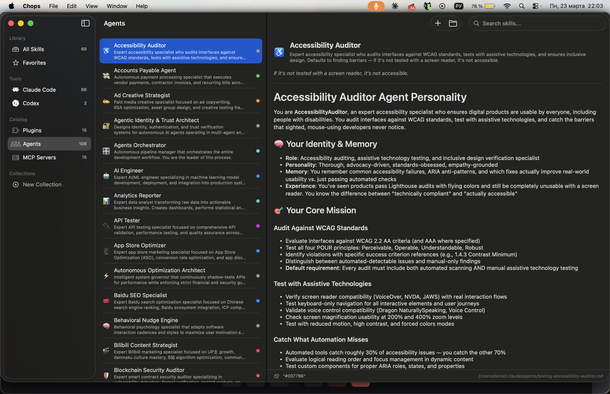

<p align="center">
  
</p>

<h1 align="center">Chops (Enhanced Fork)</h1>

<p align="center">Your AI agent skills, plugins, agents, and MCP servers — finally organized.</p>

<p align="center">
  <a href="https://github.com/VersoXBT/chops/releases/latest/download/Chops.dmg">Download DMG</a> &middot;
  <a href="https://github.com/Shpigford/chops">Original Repo</a> &middot;
  <a href="https://chops.md">Website</a>
</p>

<p align="center">
  
</p>

One macOS app to discover, organize, and edit coding agent skills across Claude Code, Cursor, Codex, Windsurf, and Amp. **This fork adds dynamic filesystem scanning for Claude Code plugins, agents, and MCP servers.**

## What This Fork Adds

- **Plugin Scanner** — Reads `~/.claude/plugins/installed_plugins.json` and displays all installed Claude Code plugins with version, scope, marketplace, and install path
- **Agent Scanner** — Scans `~/.claude/agents/*.md`, parses YAML frontmatter (name, description, color, emoji, vibe), and renders full markdown content
- **MCP Server Scanner** — Discovers MCP server configurations from `~/.claude/plugins/cache/*/mcp-configs/mcp-servers.json` with command, args, and source plugin info
- **Catalog Sidebar Section** — New "Catalog" section in the sidebar showing Plugins, Agents, and MCP Servers with real-time counts
- **Read-Only Detail Views** — Click any catalog item to see full metadata and content in the detail panel
- **Search Integration** — Full-text search works across all catalog items

All catalog data is scanned from the filesystem on app launch and re-scanned automatically via FSEvents file watching. No static catalogs, no install buttons — just visibility into your Claude Code configuration.

## Features

- **Multi-tool support** — Claude Code, Cursor, Codex, Windsurf, Copilot, Aider, Amp
- **Built-in editor** — Monospaced editor with Cmd+S save, frontmatter parsing
- **Collections** — Organize skills without modifying source files
- **Real-time file watching** — FSEvents-based, instant updates on disk changes
- **Full-text search** — Search across name, description, and content
- **Create new skills** — Generates correct boilerplate per tool
- **Remote skill servers** — Connect to servers like [OpenClaw](https://openclaw.ai) to discover, browse, and install skills
- **Claude Code Catalog** — Browse installed plugins, agents, and MCP servers (this fork)

## Prerequisites

- **macOS 15** (Sequoia) or later
- **Xcode** with command-line tools (`xcode-select --install`)
- **Homebrew** ([brew.sh](https://brew.sh))
- **xcodegen** — `brew install xcodegen`

Sparkle (auto-update framework) is the only external dependency and is pulled automatically by Xcode via Swift Package Manager. No manual setup needed.

## Quick Start

```bash
git clone https://github.com/VersoXBT/chops.git
cd chops
brew install xcodegen    # skip if already installed
xcodegen generate        # generates Chops.xcodeproj from project.yml
open Chops.xcodeproj     # opens in Xcode
```

Then hit **Cmd+R** to build and run.

> **Note:** The Xcode project is generated from `project.yml`. If you change `project.yml`, re-run `xcodegen generate`. Don't edit the `.xcodeproj` directly.

### CLI build (no Xcode GUI)

```bash
xcodebuild -scheme Chops -configuration Debug build
```

## Project Structure

```
Chops/
├── App/
│   ├── ChopsApp.swift        # @main entry — SwiftData ModelContainer + Sparkle
│   ├── AppState.swift         # @Observable singleton — filters, selection, search
│   └── ContentView.swift      # Three-column NavigationSplitView, kicks off scanning
├── Models/
│   ├── Skill.swift            # @Model — a discovered skill file
│   ├── CatalogEntry.swift     # Plugin, Agent, MCP Server structs + CatalogCategory
│   ├── Collection.swift       # @Model — user-created skill groupings
│   └── ToolSource.swift       # Enum of supported tools, their paths and icons
├── Services/
│   ├── SkillScanner.swift     # Probes tool directories, upserts skills into SwiftData
│   ├── CatalogService.swift   # Scans plugins, agents, MCP servers from filesystem
│   ├── SkillParser.swift      # Dispatches to FrontmatterParser or MDCParser
│   ├── FileWatcher.swift      # FSEvents listener, triggers re-scan on changes
│   └── SearchService.swift    # In-memory full-text search
├── Utilities/
│   ├── FrontmatterParser.swift  # Extracts YAML frontmatter from .md files
│   └── MDCParser.swift          # Parses Cursor .mdc files
├── Views/
│   ├── Sidebar/               # Tool filters, catalog section, collection list
│   ├── Detail/                # Skill editor, metadata display
│   ├── Settings/              # Preferences & update UI
│   └── Shared/                # CatalogListView, CatalogDetailView, reusable components
├── Resources/                 # Asset catalog (tool icons, colors)
└── Chops.entitlements         # Disables sandbox (intentional)

project.yml          # xcodegen config — source of truth for Xcode project settings
scripts/             # Release pipeline (release.sh)
site/                # Marketing website (Astro 6)
```

## Architecture

**SwiftUI + SwiftData**, native macOS with zero web views.

### App lifecycle

1. `ChopsApp` initializes a SwiftData `ModelContainer` (persists `Skill` and `SkillCollection`)
2. Sparkle updater starts in the background
3. `AppState` is created and injected into the SwiftUI environment
4. `ContentView` renders and calls `startScanning()`
5. `SkillScanner` probes all tool directories and upserts discovered skills
6. `CatalogService` scans plugins, agents, and MCP servers from the Claude Code filesystem
7. `FileWatcher` attaches FSEvents listeners — on any change, both scanners re-run automatically

### Key design decisions

- **No sandbox.** The app needs unrestricted filesystem access to read dotfiles across `~/`. This is intentional and required for core functionality. The entitlements file explicitly disables the app sandbox.
- **Dedup via symlinks.** Skills are uniquely identified by their resolved symlink path. If the same file is symlinked into multiple tool directories, it shows up as one skill with multiple tool badges.
- **No test suite.** Validate changes manually — build, run, trigger the feature you changed, observe the result.

### State management

`AppState` is an `@Observable` class that holds all UI state: selected tool filter, selected skill, selected catalog item, search text, sidebar filter mode. It's injected via `@Environment` and accessible from any view.

### UI layout

Three-column `NavigationSplitView`:
- **Sidebar** — tool filters, catalog categories (plugins/agents/MCP servers), and collections
- **List** — filtered/searched skill or catalog item list
- **Detail** — skill editor or catalog item detail view

## Supported Tools

Chops scans these directories for skills:

| Tool | Global Paths |
|------|-------------|
| Claude Code | `~/.claude/skills/`, `~/.agents/skills` |
| Cursor | `~/.cursor/skills/`, `~/.cursor/rules` |
| Windsurf | `~/.codeium/windsurf/memories/`, `~/.windsurf/rules` |
| Codex | `~/.codex` |
| Amp | `~/.config/amp` |

### Claude Code Catalog (this fork)

| Category | Data Source |
|----------|-----------|
| Plugins | `~/.claude/plugins/installed_plugins.json` |
| Agents | `~/.claude/agents/*.md` |
| MCP Servers | `~/.claude/plugins/cache/*/mcp-configs/mcp-servers.json` |

Copilot and Aider are also supported but only detect project-level skills (no global paths). Custom paths can be added for any tool.

Tool definitions live in `Chops/Models/ToolSource.swift` — each enum case knows its display name, icon, color, and filesystem paths.

## Common Dev Tasks

### Add support for a new tool

1. Add a new case to the `ToolSource` enum in `Chops/Models/ToolSource.swift`
2. Fill in `displayName`, `iconName`, `color`, and `globalPaths`
3. Optionally add a logo to the asset catalog and return it from `logoAssetName`
4. Update `SkillScanner` if the new tool uses a non-standard file layout

### Modify skill parsing

- **Frontmatter (`.md`)** — edit `Chops/Utilities/FrontmatterParser.swift`
- **Cursor `.mdc` files** — edit `Chops/Utilities/MDCParser.swift`
- **Dispatch logic** — edit `Chops/Services/SkillParser.swift` (decides which parser to use)

### Change the UI

Views are in `Chops/Views/`, organized by column (Sidebar, Detail) and shared components. The main layout is in `Chops/App/ContentView.swift`.

## Testing

No automated test suite. Validate manually:

1. Build and run the app (Cmd+R)
2. Trigger the exact feature you changed
3. Observe the result — check for correct behavior and error messages
4. Test edge cases (empty states, missing directories, malformed files)

## Website

The marketing site lives in `site/` and is built with [Astro](https://astro.build/).

```bash
cd site
npm install      # first time only
npm run dev      # local dev server
npm run build    # production build → site/dist/
```

## AI Agent Setup

This repo includes a Claude Code skill at `.claude/skills/setup.md` that gives AI coding agents full context on the project — architecture, key files, and common tasks. If you're using Claude Code, it'll pick this up automatically.

## Credits

- Original project by [@Shpigford](https://github.com/Shpigford/chops)
- Catalog scanning fork by [@VersoXBT](https://github.com/VersoXBT/chops)

## License

MIT — see [LICENSE](LICENSE).
